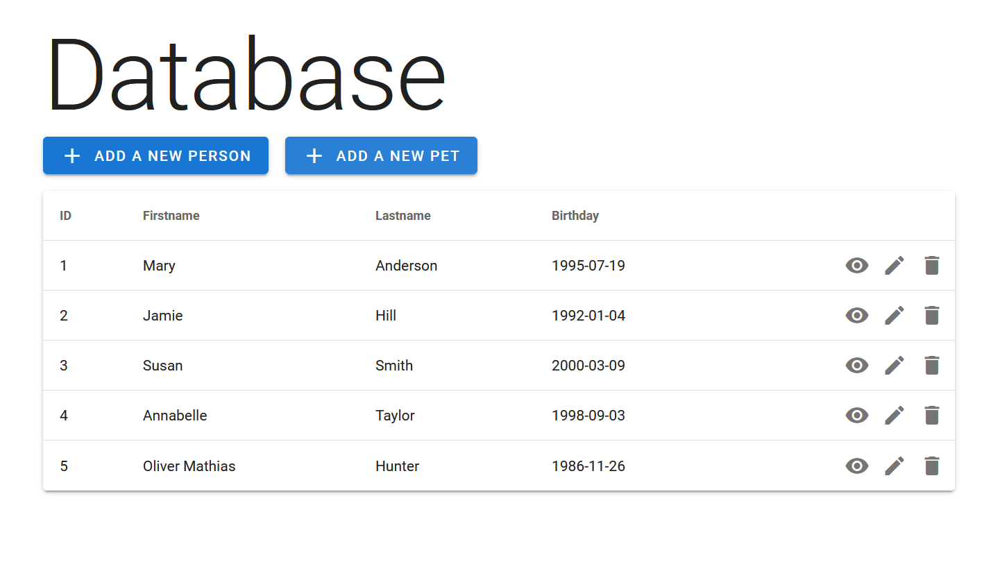
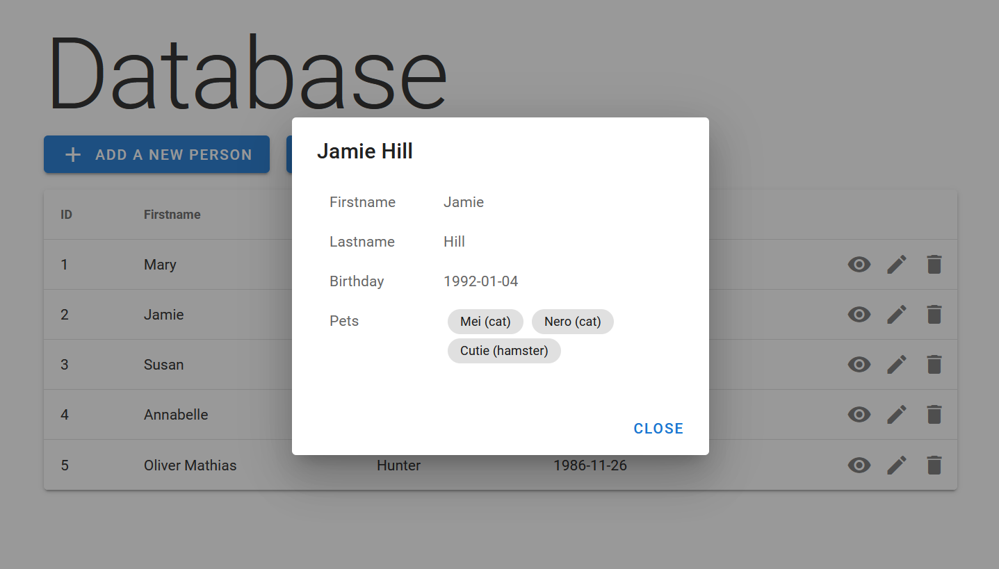
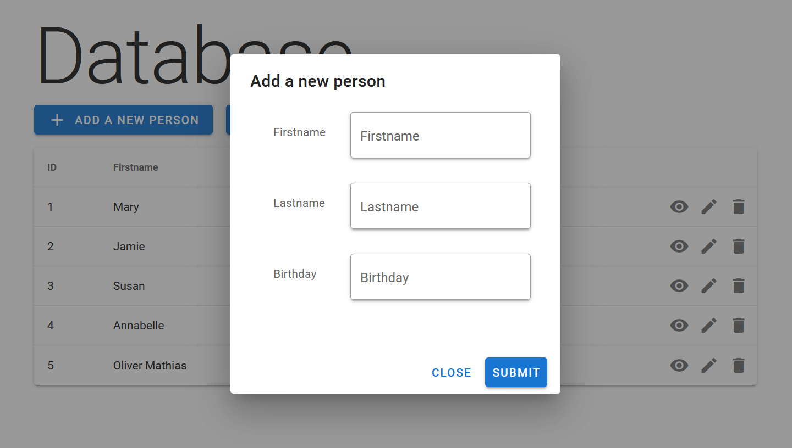
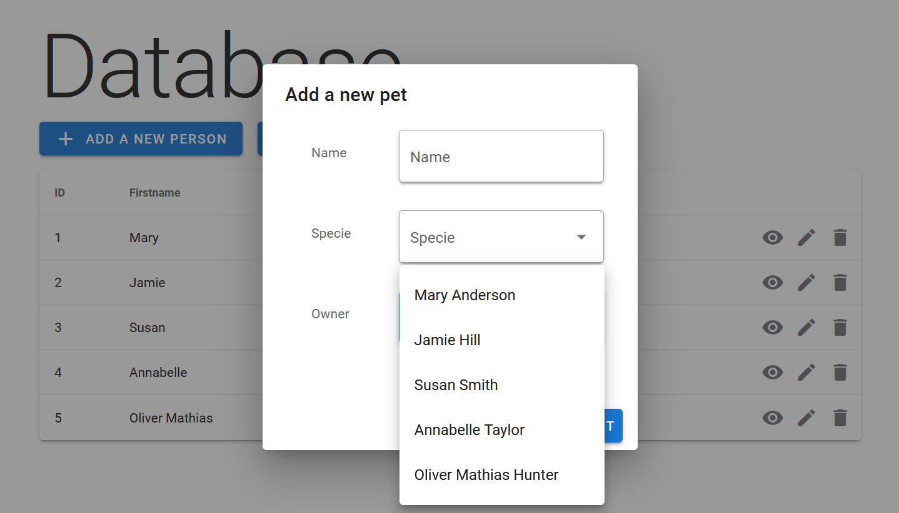
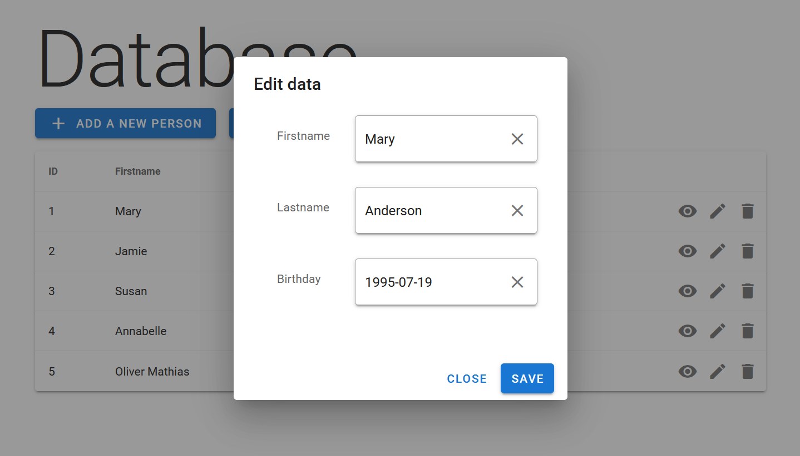
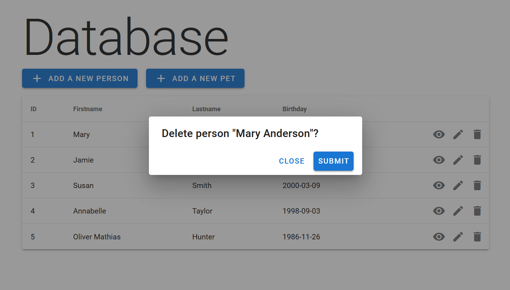
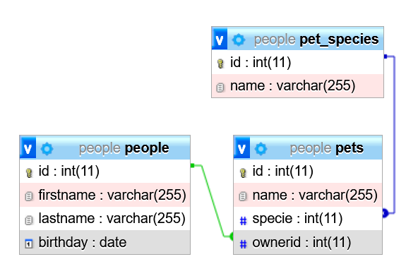

# Nuxt.js project with a database

Nuxt.js application with a database connection made with Express.js. This project is done purely for practice purposes.

The index page contains a simple table filled with each person's name, lastname and birthday. On the right there are three buttons for viewing, editing and deleting the selected row. Pets can be added to existing people and are listed in the preview dialog with the personal information.




## Technologies

- [Nuxt.js](https://nuxtjs.org/) - Vue.js Framework
- [Vuetify](https://vuetifyjs.com/en/) - Material Design UI Framework for Vue.js
- [Axios](https://axios.nuxtjs.org/) - Axios integration for Nuxt.js
- [Express.js](https://expressjs.com/) - Node.js Framework
- MySQL/MariaDB - Database

## Screenshots







## Database
Database "people" contains three tables: "people", "pets" and "pet_species"


## Before Setup

- Import **database.sql** into a database
- Change credentials in **api/index.js**

## Build Setup

```bash
# install dependencies
$ npm install

# serve with hot reload at localhost:3000
$ npm run dev

# build for production and launch server
$ npm run build
$ npm run start

# generate static project
$ npm run generate
```

For detailed explanation on how things work, check out the [documentation](https://nuxtjs.org).